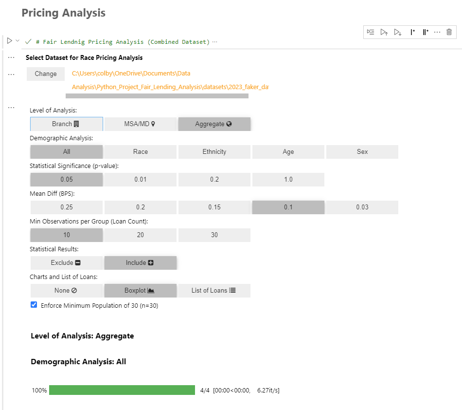
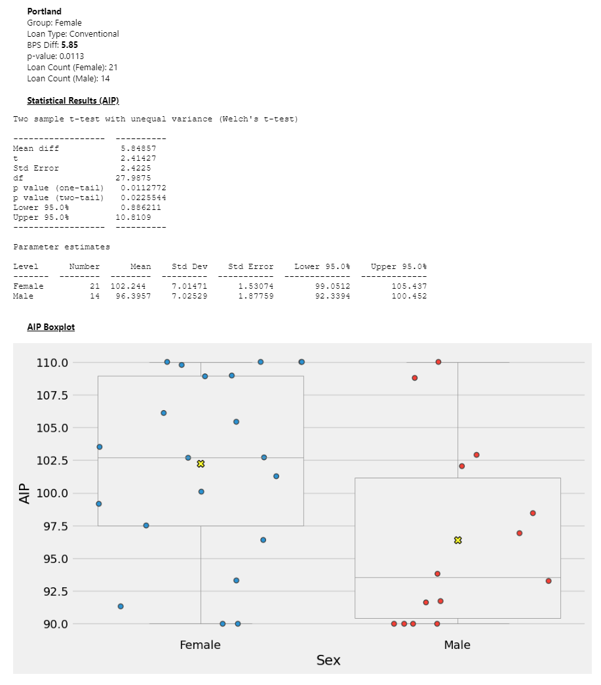
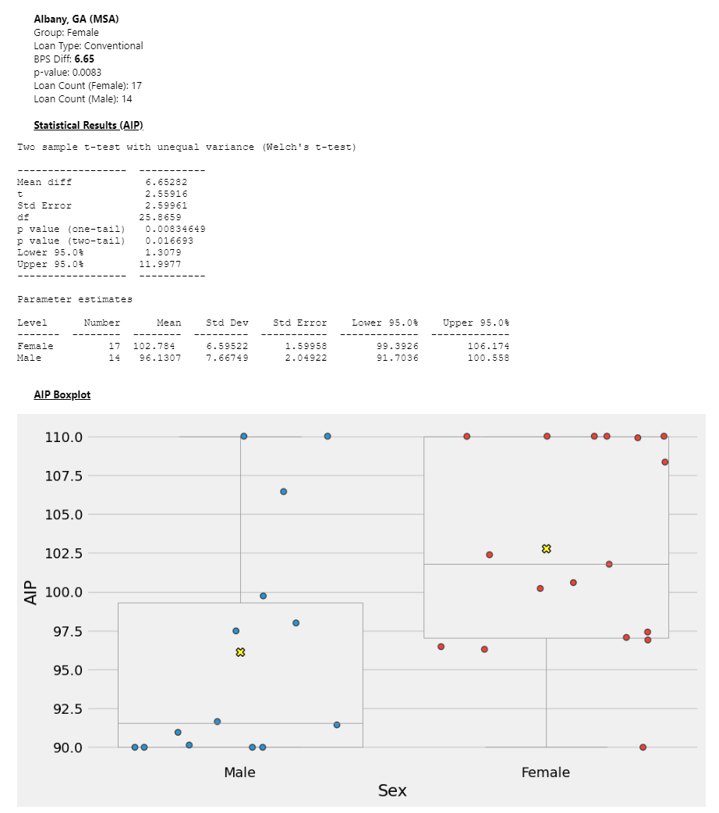

# Introduction
In this project, I'm going to use Python (Jupyter Notebooks) to perform Fair Lending Analysis on fake borrower data (that I created that mimics what lenders disclose to the FFIEC for the Home Mortgage Disclosure Act (HMDA)). I also include my Python code I wrote to create the fake borrower data in this repo.

# Background
As part of my role as a data analyst at a mortgage lender, I was tasked with spearheading the development of a fair lending monitoring program that mimicked the analysis that examiners and regulators (examiners) perform on lenders HMDA data. 

The analysis needed to be done in reoccuring intervals (typically quarterly) and at the lender's branch-level. Examiners generally perform this analysis at the national and metropolitan statistical area (MSA) levels. However, change can be difficult to make when identifying at the company and MSA levels, so the lender's branch-level is the most appropriate level to perform the analysis. 

As the monitoring program matured, I added in the company and MSA levels of analysis to the program in addition to the existing branch-level analysis.

The basis for the analysis is the [Home Mortgage Disclosure Act (HMDA)](https://www.ffiec.gov/hmda/hmda.htm). The HMDA is a federal law that protects borrowers from unfair lending practices. The HMDA requires lenders to disclose information about borrowers to the Federal Financial Institutions Examination Council (FFIEC). The FFIEC is the agency that reviews lenders' HMDA data.

I used the mortgage industry's pricing metric of "All-in-Price" (AIP) to determine if the borrowers from different demographic groups get premiums or shortages or pay higher or lower prices for their mortgages. The term **“mortgage all-in price”** typically refers to the total cost of a mortgage, including not only the interest rate but also any additional fees and costs associated with obtaining the mortgage.

# Tools I Used
For this analysis I used:

- **Python:** I used Python (3.12) to perform the analysis. I used Jupyter Notebooks to create the analysis.
- **Pandas:** I used Pandas to read in the data and perform the analysis.
- **Faker:** I used Faker to create the fake borrower data.
- **Bioinfokit:** I used Bioinfokit to perform the statistical analysis.
- **Matplotlib:** I used Matplotlib to create the visualizations.
- **Seaborn:** I used Seaborn to create the visualizations.
- **Ipywidgets:** I used Ipywidgets to create the interactive UI for the analysis to allow the user to select the different perameters of the analysis including the inclusion of visualations, list of loans, stat charts, etc.
- **VS Code:** I used VS Code to create the Jupyter Notebooks.
- **Git & GitHub:** I used Git and GitHub to track my work.

# Dataset
As noted above, ***I did not use any real borrower data from FFIEC, or any lender***. The dataset I used was created using the Faker library in Python. The dataset contains 10,000 fake borrowers. The dataset includes the necessary information (e.g., Race, Ethnicity, Age, Sex, MSA Code, Branch Name, State, Rate Spread, APR, APOR, Loan Amount, Action Taken, etc.) to perform the analysis.

See the Population Generator file here: [Python Files Folder](/ipynb_files/)

# Analysis
The pricing analysis tests for differences in terms of discretionary pricing (premiums/shortages), or All-in-Price (AIP). In the analysis of premiums/shortages, I also performed statistical tests for differences at the branch level for those branches having sufficient volume for separate analysis. In the industry, reference to the minority race/ethnicity, female, and senior (age 62 or older) applicants as “target” groups, and we refer to non-Hispanic white, male, and non-senior applicants as “comparison” groups.

The analysis is broken down into the following sections:
## User Interface

*Note: As the user changes the parameters of the analysis, the analysis will update to reflect the changes and the progress bar will update to reflect the progress of the analysis.*

## Branch Level Analysis

## MSA Level Analysis

## National Analysis

# Conclusion
The analysis shows that the discretionary pricing (premiums/shortages) is higher for some of the target groups (minority race/ethnicity, female, and senior) compared to the comparison groups (non-Hispanic white, male, and non-senior). The dataset is completely randomized, so the results are not statistically significant. 

The purpose of this analysis is to demonstrate how statistics can be applied by a company to determine potential concerns or risks, in this case, fair lending, but could be applied to quality control, customer support data, or other data sets. The analysis could be used to identify trends and patterns in the data, and could be used to create a dashboard that allows the company to monitor the fair lending program.